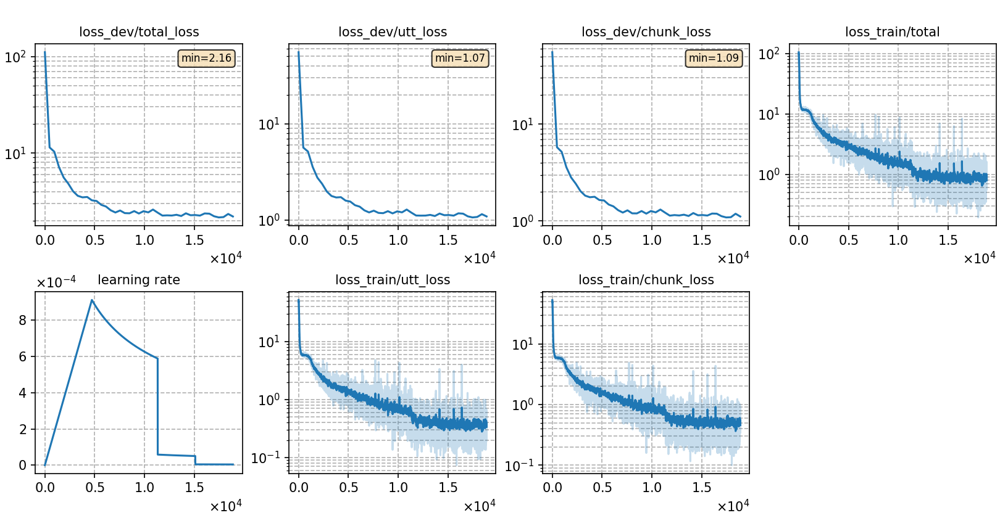

### Basic info

**This part is auto-generated, add your details in Appendix**

* \# of parameters (million): 21.15
* GPU info \[9\]
  * \[9\] NVIDIA GeForce RTX 3090


### Result
```
last-5
test_raw        %SER 88.18 | %CER 29.37 [ 38562 / 131298, 3893 ins, 5303 del, 29366 sub ]

last-3
test_raw        %SER 88.15 | %CER 29.37 [ 38561 / 131298, 3878 ins, 5314 del, 29369 sub ]

best-3
Time = 534.67 s | RTF = 0.80
CH8
Non-streaming
test_raw        %SER 88.20 | %CER 29.34 [ 38529 / 131298, 3886 ins, 5298 del, 29345 sub ]
dev_alimeeting_raw      %SER 81.53 | %CER 37.01 [ 7127 / 19256, 565 ins, 965 del, 5597 sub ]
test_alimeeting_raw     %SER 80.18 | %CER 33.14 [ 20279 / 61184, 1316 ins, 2805 del, 16158 sub ]
test_706_array_raw      %SER 100.00 | %CER 74.85 [ 756 / 1010, 38 ins, 155 del, 563 sub ]
simu_circular_raw       %SER 99.92 | %CER 75.61 [ 79217 / 104765, 2466 ins, 34176 del, 42575 sub ]
simu_linear_raw %SER 99.90 | %CER 77.23 [ 80907 / 104765, 3356 ins, 34119 del, 43432 sub ]
simu_square_raw %SER 99.96 | %CER 76.36 [ 79995 / 104765, 2793 ins, 34358 del, 42844 sub ]

  Streaming
  test_raw        %SER 92.01 | %CER 34.37 [ 45122 / 131298, 5243 ins, 6043 del, 33836 sub ]
  dev_alimeeting_raw      %SER 85.63 | %CER 41.61 [ 8013 / 19256, 631 ins, 1149 del, 6233 sub ]
  test_alimeeting_raw     %SER 84.79 | %CER 37.66 [ 23044 / 61184, 1591 ins, 3346 del, 18107 sub ]
  test_706_array_raw      %SER 100.00 | %CER 79.50 [ 803 / 1010, 31 ins, 201 del, 571 sub ]
  simu_circular_raw       %SER 99.99 | %CER 80.00 [ 83807 / 104765, 3779 ins, 32013 del, 48015 sub ]
  simu_linear_raw %SER 100.00 | %CER 81.60 [ 85490 / 104765, 4737 ins, 30714 del, 50039 sub ]
  simu_square_raw %SER 99.96 | %CER 80.52 [ 84355 / 104765, 4017 ins, 31577 del, 48761 sub ]

CH4[1,3,5,7]
test_raw        %SER 88.64 | %CER 29.57 [ 38822 / 131298, 3987 ins, 5235 del, 29600 sub ]
  streaming
  test_raw        %SER 92.10 | %CER 34.74 [ 45618 / 131298, 5453 ins, 5966 del, 34199 sub ]


CH2[1,5]
test_raw        %SER 89.20 | %CER 31.66 [ 41564 / 131298, 4275 ins, 5578 del, 31711 sub ]
  streaming
  test_raw        %SER 92.82 | %CER 36.80 [ 48321 / 131298, 5681 ins, 6426 del, 36214 sub ]


best-5
test_raw        %SER 88.36 | %CER 29.37 [ 38556 / 131298, 3908 ins, 5286 del, 29362 sub ]


best-10
test_raw        %SER 88.28 | %CER 29.37 [ 38566 / 131298, 3920 ins, 5218 del, 29428 sub ]


```

|     training process    |
|:-----------------------:|
||
