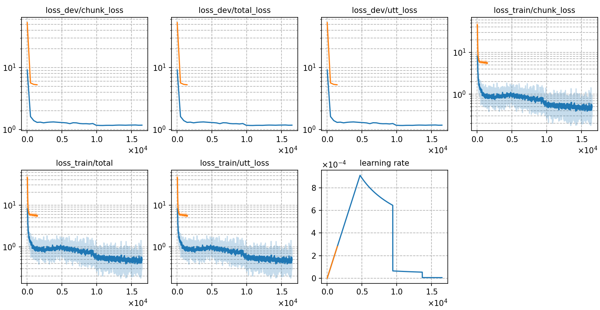

### Basic info

**This part is auto-generated, add your details in Appendix**

* \# of parameters (million): 21.16
* GPU info \[10\]
  * \[10\] NVIDIA GeForce RTX 3090

### Notes

* 
pack_data(): remove 1795 unqualified sequences.   
of frames: 2502494445 | tokens: 651923 | seqs: 33930 
of frames: 133634226 | tokens: 34613 | seqs: 1881

"filter": "10000:300000"
pack_data(): remove 1857 unqualified sequences
of frames: 2481989412 | tokens: 646443 | seqs: 33868
of frames: 133634226 | tokens: 34613 | seqs: 1881

"dev_alimeeting_raw",
            "test_alimeeting_raw",
            "test_706_array_raw",
            "simu_circular_raw",
            "simu_linear_raw",
            "simu_square_raw"

### Result
```
best-20
test_raw        %SER 88.66 | %CER 30.24 [ 39705 / 131298, 4755 ins, 4630 del, 30320 sub ]

best-5
CH8
test_raw        %SER 88.83 | %CER 30.51 [ 40062 / 131298, 4605 ins, 4903 del, 30554 sub ]
  streaming
  test_raw        %SER 97.26 | %CER 59.32 [ 77885 / 131298, 651 ins, 45750 del, 31484 sub ]


CH4[1,3,5,7]
test_raw        %SER 90.00 | %CER 33.44 [ 43901 / 131298, 4701 ins, 5672 del, 33528 sub ]
  streaming
  test_raw        %SER 97.64 | %CER 63.20 [ 82978 / 131298, 495 ins, 51730 del, 30753 sub ]

CH2[1,5]
test_raw        %SER 91.04 | %CER 36.61 [ 48067 / 131298, 5144 ins, 6264 del, 36659 sub ]
  streaming
  test_raw        %SER 97.91 | %CER 65.85 [ 86460 / 131298, 422 ins, 54914 del, 31124 sub ]


```

|     training process    |
|:-----------------------:|
||

Streaming:

model.get_model_flops(time = 1)
Model FLOPs: 14.26 GFLOPs
Model Parameters: 0.43 M

model.get_model_flops(time = 2)
Model FLOPs: 28.52 GFLOPs
Model Parameters: 0.43 M

3s
Model FLOPs: 42.78 GFLOPs
Model Parameters: 0.43 M

4
Model FLOPs: 57.03 GFLOPs
Model Parameters: 0.43 M

5
Model FLOPs: 71.29 GFLOPs
Model Parameters: 0.43 M

6
Model FLOPs: 71.29 GFLOPs
Model Parameters: 0.43 M

7
Model FLOPs: 85.55 GFLOPs
Model Parameters: 0.43 M

8
Model FLOPs: 99.81 GFLOPs
Model Parameters: 0.43 M

9
Model FLOPs: 114.07 GFLOPs
Model Parameters: 0.43 M

10s
Model FLOPs: 128.33 GFLOPs
Model Parameters: 0.43 M


Non-streaming
T:1
Model FLOPs: 11.97 GFLOPs
Model Parameters: 0.43 M
T:2
Model FLOPs: 23.42 GFLOPs
Model Parameters: 0.43 M
T:3
Model FLOPs: 34.86 GFLOPs
Model Parameters: 0.43 M
T:4
Model FLOPs: 46.31 GFLOPs
Model Parameters: 0.43 M
T:5
Model FLOPs: 57.75 GFLOPs
Model Parameters: 0.43 M
T:6
Model FLOPs: 69.20 GFLOPs
Model Parameters: 0.43 M
T:7
Model FLOPs: 80.65 GFLOPs
Model Parameters: 0.43 M
T:8
Model FLOPs: 92.09 GFLOPs
Model Parameters: 0.43 M
T:9
Model FLOPs: 103.54 GFLOPs
Model Parameters: 0.43 M
T:10
Model FLOPs: 114.98 GFLOPs
Model Parameters: 0.43 M