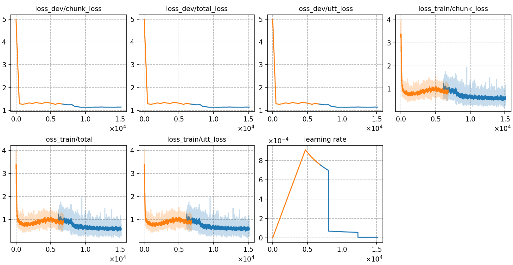

### Basic info

**This part is auto-generated, add your details in Appendix**

* \# of parameters (million): 21.58 M
* GPU info \[9\]
  * \[9\] NVIDIA GeForce RTX 3090


### Result
```
best-5
CH8
test_raw        %SER 88.85 | %CER 31.20 [ 40962 / 131298, 4549 ins, 4935 del, 31478 sub ]
  streaming
  test_raw        %SER 97.53 | %CER 59.52 [ 78144 / 131298, 896 ins, 42979 del, 34269 sub ]

CH4
test_raw        %SER 89.49 | %CER 32.32 [ 42434 / 131298, 4772 ins, 4952 del, 32710 sub ]
  streaming
  test_raw        %SER 97.56 | %CER 60.78 [ 79808 / 131298, 866 ins, 44379 del, 34563 sub ]

CH2
test_raw        %SER 89.81 | %CER 33.42 [ 43878 / 131298, 4824 ins, 5374 del, 33680 sub ]
  streaming
  test_raw        %SER 97.53 | %CER 62.00 [ 81406 / 131298, 822 ins, 46147 del, 34437 sub ]


```

|     training process    |
|:-----------------------:|
||

